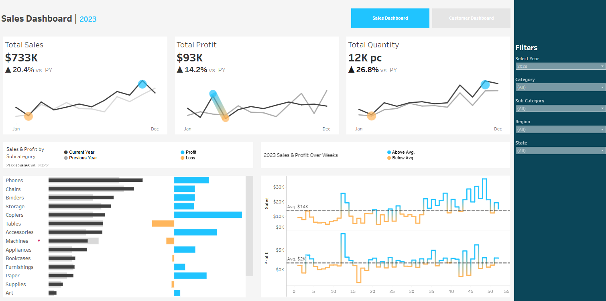

## 📊 **Sales Dashboard**

The **Sales Dashboard** provides a clear and interactive overview of sales performance across categories, sub-categories, and regions. It helps identify trends in revenue, profit, and quantity, allowing decision-makers to monitor year-over-year performance and highlight growth opportunities.

### 🔍 **Key Insights**
- Total Sales, Profit, and Quantity trends over time  
- Performance comparison with the previous year  
- Sales & Profit analysis by sub-category  
- Weekly average performance highlighting above/below-average periods  
- Interactive filters for year, category, sub-category, region, and state  

### 🖼️ **Dashboard Preview**

### 🔗 **View Full Dashboard**
[👉 Click here to view project](https://public.tableau.com/app/profile/mohammed.khalifa7230/viz/sales-project_17575827020040/SalesDashboard)
